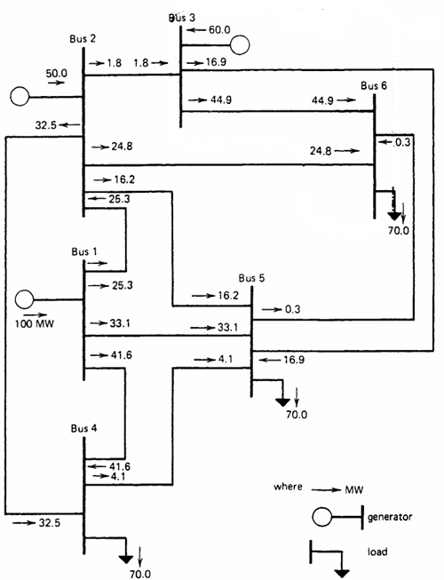

## System power IEEE 6 BUS/ Sistema de potencia IEEE 6 BUS

# Power System Sensitivity Analysis

This project performs a sensitivity analysis on a power system by calculating important factors such as the Generation Shift Factor (GSF) and the Line Outage Distribution Factor (LODF).

## Theoretical Framework
### Generation Shift Factor (GSF)

The GSF measures the change in power flow in a transmission line due to a change in generation at a specific node.

${GSF_{ij} = \frac{1}{x_{ij}} (W_{ki} - W_{mi})}$

Where:
- ${x_{ij}}$ is the reactance of the line ${ij}$.
- ${W_{ki}}$ and ${W_{mi}}$ are elements of the inverse of the nodal admittance matrix.

### Line Outage Distribution Factor (LODF)

The LODF measures the change in power flow in a transmission line due to the disconnection of another line.

${LODF_{lk} = \frac{\frac{x_k}{x_l} (X_{in} - X_{jn} - X_{im} + X_{jm})}{x_k - (X_{nn} + X_{mm} - 2X_{nm})}}$

Where:
- ${x_k}$ and ${x_l}$ are the reactances of the lines ${k}$ and ${l}$.
- ${X_{in}, X_{im}, X_{jn}, X_{jm}}$ are elements of the nodal admittance matrix.

Where:
- ${x_k}$ and ${x_l}$ are the reactances of the lines ${k}$ and ${l}$.
- ${X_{in}}$, ${X_{im}}$, ${X_{jn}}$, ${X_{jm}}$ are elements of the nodal admittance matrix. Specifically:
  - ${X_{in}}$ is the element of the nodal admittance matrix corresponding to node ${i}$ and node ${n}$.
  - ${X_{im}}$ is the element of the nodal admittance matrix corresponding to node ${i}$ and node ${m}$.
  - ${X_{jn}}$ is the element of the nodal admittance matrix corresponding to node ${j}$ and node ${n}$.
  -${X_{jm}}$ is the element of the nodal admittance matrix corresponding to node ${j}$ and node ${m}$ .

\\

# Análisis de Sensibilidad en Sistemas de Potencia

Este proyecto realiza un análisis de sensibilidad en un sistema de potencia calculando factores importantes como el Generation Shift Factor (GSF) y el Line Outage Distribution Factor (LODF).

## Marco Teórico
### Generation Shift Factor (GSF)

El GSF mide el cambio en el flujo de potencia en una línea de transmisión debido a un cambio en la generación en un nodo específico.

${GSF_{ij} = \frac{1}{x_{ij}} (W_{ki} - W_{mi})}$

Donde:
- ${x_{ij}}$ es la reactancia de la línea ${ij}$.
-  ${W_{ki}}$ y ${W_{mi}}$ son elementos de la inversa de la matriz de admitancias nodales.

### Line Outage Distribution Factor (LODF)

El LODF mide el cambio en el flujo de potencia en una línea de transmisión debido a la desconexión de otra línea.

${LODF_{lk} = \frac{\frac{x_k}{x_l} (X_{in} - X_{jn} - X_{im} + X_{jm})}{x_k - (X_{nn} + X_{mm} - 2X_{nm})}}$

Donde:
- ${x_k}$ y ${x_l}$ son las reactancias de las líneas  ${k}$ y ${l}$.
- ${X_{in}, X_{im}, X_{jn}, X_{jm}}$ son elementos de la matriz de admitancias nodales.

Donde:
- ${x_k}$ y ${x_l}$ son las reactancias de las líneas ${k}$ y ${l}$.
- ${X_{in}}$, ${X_{im}}$, ${X_{jn}}$, ${X_{jm}}$ son elementos de la matriz de admitancias nodales. Específicamente:
  - ${X_{in}}$ es el elemento de la matriz de admitancias nodales correspondiente al nodo ${i}$ y al nodo ${n}$.
  - ${X_{im}}$ es el elemento de la matriz de admitancias nodales correspondiente al nodo ${i}$ y al nodo ${m}$.
  - ${X_{jn}}$ es el elemento de la matriz de admitancias nodales correspondiente al nodo ${j}$ y al nodo ${n}$.
  - ${X_{jm}}$ es el elemento de la matriz de admitancias nodales correspondiente al nodo ${j}$ y al nodo ${m}$.

## BUS SYSTEM IEEE 6 BUS
___

___

## Archivos de Entrada

### Datos de lineas `lines.csv`

Tabla con las siguientes columnas:

| FROM | TO | TYPE | R   | X   | B    | LIM1 | LIM2 | LIM3 | TAP | TAPMIN | TAPMAX | STEP | TANG |
|------|----|------|-----|-----|------|------|------|------|-----|--------|--------|------|------|
| 1    | 2  | 0    | 0.10| 0.20| 0.020| 0.7  | 0    | 0    | 0   | 0      | 0      | 0    | 0    |
| 1    | 4  | 0    | 0.05| 0.20| 0.020| 0.9  | 0    | 0    | 0   | 0      | 0      | 0    | 0    |
| 1    | 5  | 0    | 0.08| 0.30| 0.030| 0.7  | 0    | 0    | 0   | 0      | 0      | 0    | 0    |
| 2    | 3  | 0    | 0.05| 0.25| 0.030| 0.2  | 0    | 0    | 0   | 0      | 0      | 0    | 0    |
| 2    | 4  | 0    | 0.05| 0.10| 0.010| 0.5  | 0    | 0    | 0   | 0      | 0      | 0    | 0    |
| 2    | 5  | 0    | 0.10| 0.30| 0.020| 0.4  | 0    | 0    | 0   | 0      | 0      | 0    | 0    |
| 2    | 6  | 0    | 0.07| 0.20| 0.025| 0.6  | 0    | 0    | 0   | 0      | 0      | 0    | 0    |
| 3    | 5  | 0    | 0.12| 0.26| 0.025| 0.3  | 0    | 0    | 0   | 0      | 0      | 0    | 0    |
| 3    | 6  | 0    | 0.02| 0.10| 0.010| 0.7  | 0    | 0    | 0   | 0      | 0      | 0    | 0    |
| 4    | 5  | 0    | 0.20| 0.40| 0.040| 0.3  | 0    | 0    | 0   | 0      | 0      | 0    | 0    |
| 5    | 6  | 0    | 0.10| 0.30| 0.030| 0.2  | 0    | 0    | 0   | 0      | 0      | 0    | 0    |

### Dtos de nodos `nodes.csv`

Tabla con las siguientes columnas:

| NUMBER | NAME | TYPE | VPU  | ANG | PLOAD | QLOAD | PGEN | QGEN | KVBASE | QMIN | QMAX | G | B | ID |
|--------|------|------|------|-----|-------|-------|------|------|--------|------|------|---|---|----|
| 1      | 1    | 3    | 1.05 | 0   | 0.0   | 0.0   | 0.0  | 0.0  | 230    | 0    | 0    | 0 | 0 | 1  |
| 2      | 2    | 2    | 1.05 | 0   | 0.0   | 0.0   | 0.5  | 0.0  | 230    | 0    | 0    | 0 | 0 | 2  |
| 3      | 3    | 2    | 1.00 | 0   | 0.0   | 0.0   | 0.6  | 0.0  | 230    | 0    | 0    | 0 | 0 | 3  |
| 4      | 4    | 0    | 1.00 | 0   | 0.7   | 0.7   | 0.0  | 0.0  | 230    | 0    | 0    | 0 | 0 | 4  |
| 5      | 5    | 0    | 1.00 | 0   | 0.7   | 0.7   | 0.0  | 0.0  | 230    | 0    | 0    | 0 | 0 | 5  |
| 6      | 6    | 0    | 1.00 | 0   | 0.7   | 0.7   | 0.0  | 0.0  | 230    | 0    | 0    | 0 | 0 | 6  |

## Funciones

### `carga_datos()`

**Descripción (Description):** Carga los datos de las líneas y nodos desde archivos CSV y los convierte en DataFrames.

- **Entradas (Inputs):** Ninguna.
- **Salidas (Outputs):**
  - `lin`: DataFrame con los datos de las líneas.
  - `nod`: DataFrame con los datos de los nodos.
  - `num_lin`: Número de líneas.
  - `num_nod`: Número de nodos.

### `crear_Ykm(lin, nod)`

**Descripción (Description):** Crea la matriz de admitancias del sistema.

- **Entradas (Inputs):**
  - `lin`: DataFrame con los datos de las líneas.
  - `nod`: DataFrame con los datos de los nodos.
- **Salidas (Outputs):**
  - `Ykm`: Matriz de admitancias.

### `reducir_Ybus(Ybus)`

**Descripción (Description):** Elimina el nodo slack de la matriz de admitancias.

- **Entradas (Inputs):**
  - `Ybus`: Matriz de admitancias.
- **Salidas (Outputs):**
  - `Ybus_red`: Matriz de admitancias reducida.

### `inversa_Ybus(Ybus_red)`

**Descripción (Description):** Calcula la inversa de la matriz de admitancias reducida.

- **Entradas (Inputs):**
  - `Ybus_red`: Matriz de admitancias reducida.
- **Salidas (Outputs):**
  - `Ybus_inv`: Inversa de la matriz de admitancias reducida.

### `calcular_GSF(Ybus_inv, lin, nod)`

**Descripción (Description):** Calcula el Generation Shift Factor (GSF).

- **Entradas (Inputs):**
  - `Ybus_inv`: Inversa de la matriz de admitancias reducida.
  - `lin`: DataFrame con los datos de las líneas.
  - `nod`: DataFrame con los datos de los nodos.
- **Salidas (Outputs):**
  - `GSF`: Matriz de Generation Shift Factor.

### `calcular_LODF(X, lin)`

**Descripción (Description):** Calcula el Line Outage Distribution Factor (LODF).

- **Entradas (Inputs):**
  - `X`: Inversa de la matriz de admitancias reducida.
  - `lin`: DataFrame con los datos de las líneas.
- **Salidas (Outputs):**
  - `LODF`: Matriz de Line Outage Distribution Factor.

### `main()`

**Descripción (Description):** Función principal que coordina la carga de datos, el cálculo de la matriz de admitancias, el flujo de potencia en operación normal, el análisis de contingencias y la visualización de resultados.

- **Entradas (Inputs):** Ninguna.
- **Salidas (Outputs):** Ninguna (muestra los resultados en la consola y gráficos).

## Ejecución

Para ejecutar el análisis, simplemente corre el archivo `pruebal.jl` en Julia. Los resultados se mostrarán en la consola.

**Licencias**

Flujo de carga DC y analisis de contingencias by Yohan V. is licensed under <a href="https://creativecommons.org/licenses/by/4.0/?ref=chooser-v1" target="_blank" rel="license noopener noreferrer" style="display:inline-block;">CC BY 4.0</a>
